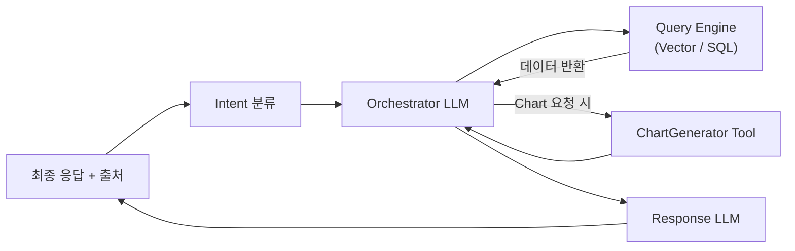

# LLM 기반 자체 데이터 검색 시스템 개발 가이드

## 1. 데이터 파이프라인 설계

1. **데이터 수집 & 정제**
   - **비정형 데이터**: 회의록(.docx/.pdf), 결과보고서, 외부 테스트자료 등
     - `UnstructuredReader` (예: `llama_index.readers.UnstructuredReader`)로 텍스트 추출
     - 필요 시 `TesseractOCRReader` 등 OCR 활용
   - **정형 데이터**: RDBMS, CSV, 마케팅 실적표 등
     - `SQLReader` 또는 `PandasReader`로 불러와 JSON 또는 DataFrame 형태 변환

2. **메타데이터 부착**
   ```json
   {
     "text": "…4월 5일 회의 내용…",
     "category": "회의록",
     "date": "2025-04-05",
     "participants": ["김철수", "마이크로소프트 마케팅 담당자"],
     "source_id": "minutes_20250405.docx"
   }


3. **인덱싱**

   * **비정형**: 벡터 인덱스

     ```python
     from llama_index import GPTVectorStoreIndex, SimpleDirectoryReader
     docs = SimpleDirectoryReader("data/unstructured/").load_data()
     index_unstruct = GPTVectorStoreIndex.from_documents(docs)
     ```
   * **정형**: SQL 데이터베이스 체인

     ```python
     from llama_index import SQLDatabase, SQLDatabaseChain
     db = SQLDatabase.from_uri("postgresql://…")
     index_struct = SQLDatabaseChain.from_llm(llm, db)
     ```

## 2. 쿼리 처리 및 의도 분류

1. **Intent 분류**

   * 룰 기반 + LLM 조합으로 `날짜검색`, `참여자필터`, `차트요청` 등 분류

2. **Retrieval & 후처리**

   * **날짜 기반 검색**

     ```python
     response = index_unstruct.query(
       "지난 4월 5일 회의 내용",
       filter_metadata={"date": "2025-04-05"}
     )
     ```
   * **참여자 필터**

     ```python
     response = index_unstruct.query(
       "마이크로소프트 마케팅 담당자 참여 회의록",
       filter_metadata={"participants": "마이크로소프트 마케팅 담당자"}
     )
     ```
   * **정형 데이터 실적 조회**

     ```python
     response = index_struct.run(
       "2024년 3분기 DRAM 실적을 표로 보여줘"
     )
     ```

## 3. 시각화 툴 연동

1. **차트 생성 함수**

   ```python
   def make_chart(df, chart_type="bar"):
       import matplotlib.pyplot as plt
       fig, ax = plt.subplots()
       if chart_type == "bar":
           ax.bar(df['period'], df['value'])
       else:
           ax.plot(df['period'], df['value'])
       ax.set_title("DRAM 3분기 실적")
       return fig
   ```
2. **LangChain Tool 등록**: `make_chart`를 Tool 인터페이스로 등록하여 Intent에 따라 호출

## 4. 출처 표기 전략

* `source_id` 메타데이터를 LLM 응답에 포함
* **Output Parser** 커스텀

  ```python
  from llama_index import OutputParser

  class CitationParser(OutputParser):
      def parse(self, response: str) -> str:
          # 본문과 함께 “[출처: minutes_20250405.docx]” 형태로 후처리
          return processed_response
  ```
* 최종 예시:

  > “4월 5일 회의에서는 … 논의되었습니다.
  > \[출처: minutes\_20250405.docx]”

## 5. 전체 아키텍처 흐름

1. 사용자 질의 → 2. Intent 분류 → 3. Orchestrator LLM → 4. Query Engine(Vector/SQL) 호출 → 5. 필요 시 ChartGenerator Tool 호출 → 6. Response LLM(응답 합성 + Citation) → 7. 사용자 응답 전달



* **Orchestrator LLM**: 사용자의 인텐트와 메타데이터를 바탕으로 어떤 툴(검색, 필터, 차트 등)을 어떤 순서로 호출할지 계획
* **Response LLM**: Orchestrator 또는 Query Engine/Tool들의 출력을 받아 자연어 응답으로 최종 합성하고, `source_id` 기반 출처 표기 적용

## 6. PoC → 운영 전환 고려사항. PoC → 운영 전환 고려사항

* **MCP 도입**: 3단계 이상의 복합 워크플로우 시 JSON 규격 레이어 추가
* **스케일링**: 벡터 인덱스 샤딩, RDB 캐싱, 차트 서비스 분리
* **모니터링**: 호출 로그, 오류율, 응답 지연, 출처 사용 빈도 분석

```
```
